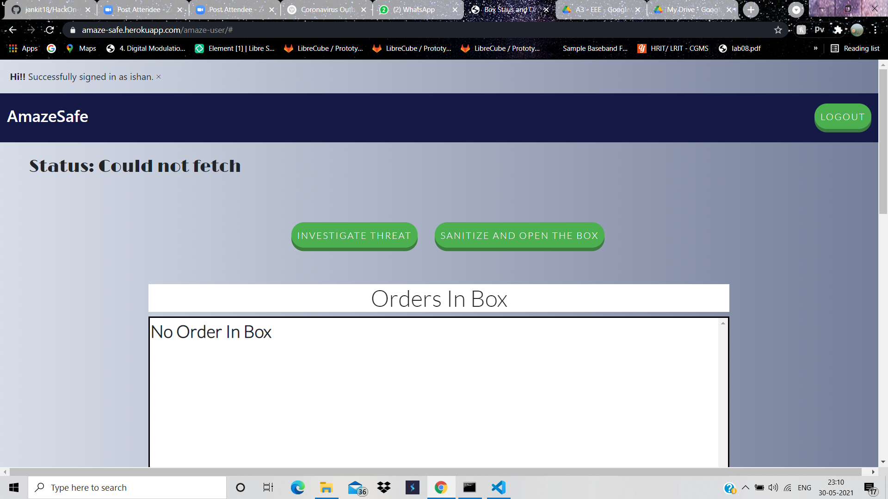
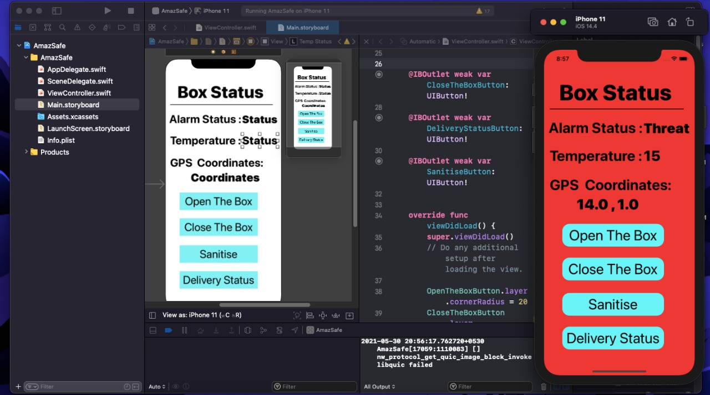

# AmazeSafe

Amazon currently engages in door to door delivery for their operations in India. However this methodology is no longer as sustainable as it used to be due to increasing threshold orders and preference of contactless delivery along with requirement of customers for being present in their residence for the delivery or relying on neighbours for collecting their deliveries. Amazon India is also currently trying to diversify their operations by shifting to delivery of daily essentials, thus a robust and effective mechanism needs to be adopted to fast and reliable delivery. The fact that Amazon is currently so dependent on customer availability bounds it’s end operations to a 9 to 10 timeline. Simply delivering the packages at doorsteps just as in US seems as a good solution however it comes with it’s own sets of problems such as package theft, loss etc. Unlike US most Indian homes don’t have reliable home security systems thus this makes it even more challenging.Thus for this to be implemented cheap but effective solutions needs to be placed to track, detect and contain packages.

This Micropython (IoT) and Python (Backend) demonstration is an implementation of the Amazon Box Delivery System prototype .

#### The main goals of this project are -

- Modularity - This module can be easily configured into any of the Wifi supported micropython boards. For example CC3200, ESP32 and ESP8266.
- Upgaradibility - Easily upgradable standards.
- Easy to Configure - These can be easlily configured and reconfigured.


#### Development Setup for ESP32

To start the server on ESP32:

- Copy the folders `src` and `devices` to the ESP32
- Copy the file `server.py` to ESP32.
- Add `import server; server.run("your wlan essid", "your password")` to `boot.py`
- Soft-restart the ESP32 to auto-start the server

Optional configurations for micropython port. You can optionally configure in src/config.py

```python
DEFAULT_BEACON_INTERVAL = 15  # SEND DATA EVERY 15 SEC
DEFAULT_LOCK_STATE = True  # States if box is locked initially
INITIAL_GPS = [0.0000, 0.0000]  # Initial GPS location where the box should be
GPS_THRESHOLD = 16  # The distance beyond which the box going is considered unsafe
URL = "https://io.adafruit.com/api/v2/"  # Adafruit default URL
USER_NAME = "XXXXXXXXXXXXXXX"  # username of the user
FEED_SEND = "xxxxxxx"  # esp sending feed
API_KEY = 'XXXXXXXXXXXXXXXXXXXXXXXXXXXX'  # api key
FEED_RECEIVE = "XXXXX"  # esp receiving feed
```

#### Constraints

- Currently only SD card has been SPI interfaced other components couldn't be ordered due to lockdown. For example camera, vibration sensors etc.
- For now GPS, Vibration and Temperature are being simulated using python random module for Testing purposes.

#### Website

Link for our website deployement is : https://amaze-safe.herokuapp.com/



#### App

Our App can be simulated for only IOS devices using XCode software.




#### 3D print

The product can be 3D printed using the STL File given further versions will lead to finer model.


*Locking Mechanism*


*Sanitize Simulation*

#### Contribute

- Issue Tracker: https://github.com/jankit18/HackOn-AmazeSafe/issues
- Source Code: https://github.com/jankit18/HackOn-AmazeSafe

#### Support

If you are having issues, please let us know. Reach us at
 [Email](mailto:shayan.majumder2@gmail.com).

#### License

The project is currently licensed under the MIT license. See the [LICENSE](./LICENSE.txt) file for details.